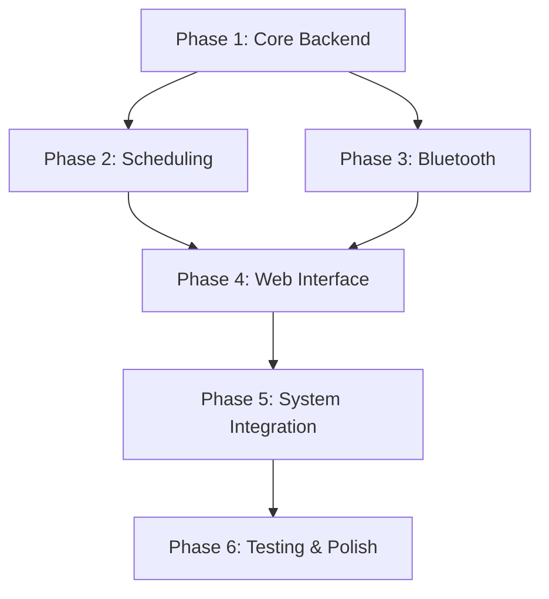

# 🔔 Church Speaker Control System — Full Plan

## Overview

A web-based speaker control system for a church, designed to be dead simple for non-technical users. It runs as a **Python backend service** on Debian 13 ("Trixie") with GNOME 48 that handles all audio playback, Bluetooth speaker management, and scheduling — exposed through a clean, intuitive **web interface** accessible from any browser on the local network.

### Why This Architecture?

| Option | Verdict |
|---|---|
| Pure web app (browser plays audio) | ❌ Browsers are sandboxed — can't access Bluetooth speakers or system audio |
| Electron / desktop app | ❌ Overkill, hard to update, must be used from the one machine |
| **Python backend + Web UI** | ✅ Backend controls system audio directly; web UI is accessible from any phone/tablet/computer on the network |

> [!IMPORTANT]
> The backend runs as a system service on the church's Debian machine. Users open a webpage (e.g., `http://church-pc:5000`) from any device on the same network to control everything.

---

## Tech Stack

| Component | Technology | Why |
|---|---|---|
| **Backend** | Python 3.13 + Flask | Ships with Debian 13; Flask is lightweight and simple |
| **Audio Playback** | VLC via `python-vlc` | Battle-tested, supports every format, respects system audio routing |
| **Audio Server** | PipeWire 1.4.2 + WirePlumber 0.5.8 (Debian 13 default) | Modern audio server; `pactl`/`wpctl` commands for sink and volume management |
| **Bluetooth** | `bluetoothctl` (via subprocess) | Standard Linux Bluetooth management; set BT speaker as default sink via `wpctl` |
| **Scheduling** | APScheduler (Python) | Cron-like job scheduling built into the backend; persists to SQLite |
| **Database** | SQLite | Zero-config, file-based, perfect for this scale |
| **Frontend** | Vanilla HTML/CSS/JS | No build step, maximum simplicity, easy to maintain |
| **Process Manager** | systemd | Auto-start on boot, restart on crash |

---

## System Architecture

```
┌─────────────────────────────────────────────────┐
│  Any device on local network                    │
│  (Phone / Tablet / Laptop)                      │
│  ┌───────────────────────────┐                  │
│  │   Web Browser             │                  │
│  │   http://church-pc:5000   │                  │
│  └───────────┬───────────────┘                  │
└──────────────┼──────────────────────────────────┘
               │ HTTP API calls
               ▼
┌─────────────────────────────────────────────────┐
│  Debian 13 (Trixie) + GNOME 48                  │
│                                                 │
│  ┌───────────────────────────────────────────┐  │
│  │  Flask Backend (Python)                   │  │
│  │  ├── REST API (play/stop/schedule/volume) │  │
│  │  ├── APScheduler (cron jobs + one-offs)   │  │
│  │  ├── VLC Player (audio playback)          │  │
│  │  ├── Bluetooth Manager (connect/discover) │  │
│  │  └── SQLite DB (schedules, music library) │  │
│  └───────────────┬───────────────────────────┘  │
│                  │ subprocess calls              │
│                  ▼                               │
│  ┌──────────────────────────────────┐           │
│  │  PipeWire + WirePlumber         │           │
│  │  ├── pipewire-pulse compat      │           │
│  │  ├── BT Speaker (default sink)  │           │
│  │  └── Volume control (wpctl)     │           │
│  └──────────────────────────────────┘           │
└─────────────────────────────────────────────────┘
```

---

## Features & Completion Checklist

### Phase 1: Core Backend
- [x] **Project scaffolding** — directory structure, virtual environment, `requirements.txt`
- [x] **Music library manager** — scan/upload music files, store metadata in SQLite
- [x] **VLC audio engine** — play, pause, stop, next, seek; playlist support
- [x] **Volume control** — global volume via `wpctl`; per-track volume via VLC API
- [x] **REST API** — endpoints for all playback and library operations
- [x] **SQLite database** — schema for music library, schedules, settings

### Phase 2: Scheduling System
- [x] **Recurring schedules** — e.g., "Every Sunday 10:30–11:05 AM, play Worship Playlist"
- [x] **Ad-hoc schedules** — e.g., "Feb 18 at 12:30 PM, play Ash Wednesday playlist for 35 min"
- [x] **Automation rules** — e.g., "Play noon chimes daily" with start/end date range
- [x] **Schedule persistence** — all jobs saved to SQLite, survive reboots
- [x] **Schedule CRUD API** — create, read, update, delete schedules via REST

### Phase 3: Bluetooth Speaker
- [x] **Bluetooth discovery** — scan for nearby Bluetooth speakers
- [x] **Bluetooth pair & connect** — pair and connect to the speaker via `bluetoothctl`
- [x] **Set as default sink** — use `wpctl` to route all audio to the connected BT speaker
- [x] **Speaker management API** — REST endpoints for Bluetooth operations
- [ ] **Speaker health monitoring** — detect if the speaker disconnects, attempt reconnection *(needs real hardware testing)*

### Phase 4: Web Interface
- [x] **Dashboard page** — shows current playback status, upcoming schedules, speaker connection status
- [x] **Now Playing controls** — big Play/Stop buttons, volume slider, current track info
- [x] **Music Library page** — browse/upload music, create and edit playlists
- [x] **Schedule Manager page** — visual calendar/list view to add/edit/delete schedules
- [x] **Speaker Manager page** — single-speaker status, discover & connect, volume control
- [x] **Settings page** — default volume, network info, system status
- [x] **Mobile-friendly responsive design** — works great on phones and tablets
- [x] **Large buttons, clear labels** — designed for older / non-technical users

### Phase 5: System Integration
- [x] **systemd service** — auto-start backend on boot
- [x] **Auto-reconnect Bluetooth** — attempt to reconnect the paired speaker on startup
- [x] **Logging** — file-based logging for debugging
- [x] **Error handling & notifications** — show clear errors in the UI when something goes wrong

### Phase 6: Testing & Polish
- [x] **Backend unit tests** — test scheduling logic, API endpoints (26 tests, all passing)
- [x] **Manual browser testing** — verify all UI flows work
- [ ] **Bluetooth integration test** — test with actual BT speaker (manual, on real hardware)
- [x] **Documentation** — README with setup instructions, user guide

---

## Project Directory Structure

```
church-music-app/
├── PLAN.md
├── README.md
├── requirements.txt
├── run.py                      # Entry point
├── app/
│   ├── __init__.py             # Flask app factory
│   ├── config.py               # Configuration
│   ├── database.py             # DB initialization and helpers
│   ├── routes/
│   │   ├── __init__.py
│   │   ├── api.py              # REST API endpoints
│   │   └── views.py            # Page routes (serve HTML)
│   ├── services/
│   │   ├── __init__.py
│   │   ├── audio_player.py     # VLC-based audio engine
│   │   ├── scheduler.py        # APScheduler integration
│   │   ├── bluetooth.py        # Bluetooth manager (bluetoothctl + wpctl)
│   │   └── volume.py           # Volume control (wpctl-only)
│   ├── static/
│   │   ├── css/
│   │   │   └── style.css       # All styles
│   │   └── js/
│   │       ├── app.js          # Shared utilities, toasts, volume control
│   │       └── player.js       # Playback controls / Now Playing UI
│   └── templates/
│       ├── base.html           # Base layout
│       ├── dashboard.html      # Dashboard / home
│       ├── library.html        # Music library
│       ├── schedules.html      # Schedule manager
│       ├── speakers.html       # Speaker manager (single speaker)
│       └── settings.html       # Settings
├── music/                      # Uploaded music files stored here
├── data/                       # SQLite database file stored here
├── tests/                      # (to be added)
└── systemd/
    └── church-bells@.service   # systemd unit file (user instance)
```

---

## Key Design Decisions

### 🎯 Designed for Non-Technical Users
- **Big, obvious buttons** — Play ▶, Stop ⏹, with icons AND text labels
- **Simple navigation** — tab/sidebar navigation with clear labels: "Now Playing", "Music", "Schedules", "Speakers"
- **Volume is a big slider** — not a tiny knob
- **No jargon** — "Add Music" not "Upload media asset", "Sunday Worship" not "Recurring cron job"
- **Confirmation dialogs** — "Are you sure you want to delete this schedule?" before destructive actions
- **Status indicators** — green dots for connected speakers, red for disconnected
- **Dark, calm color scheme** — easy on the eyes, church-appropriate aesthetic

### 🔊 Single Speaker Strategy
1. On startup, the backend auto-connects to the previously paired Bluetooth speaker
2. The speaker is set as the default PipeWire sink via `wpctl set-default <sink-id>`
3. All VLC playback is routed through the default sink → audio plays from the BT speaker
4. If the speaker disconnects, the UI shows a warning and the backend attempts reconnection
5. Volume is controlled via `wpctl set-volume <sink-id> <level>`

### 📅 Scheduling Strategy
- **APScheduler** runs inside the Flask process with a SQLite job store
- Recurring schedules use cron triggers (e.g., `day_of_week='sun', hour=10, minute=30`)
- Ad-hoc schedules use date triggers (e.g., `run_date='2026-02-18 12:30:00'`)
- Each schedule references a playlist and a duration; when triggered, the backend starts playing and sets a stop timer
- All schedules persist across reboots via SQLite

---

## API Endpoints (Draft)

### Playback
| Method | Endpoint | Description |
|---|---|---|
| `POST` | `/api/play` | Play a playlist or specific song |
| `POST` | `/api/stop` | Stop playback immediately |
| `POST` | `/api/pause` | Pause/unpause |
| `POST` | `/api/next` | Skip to next track |
| `GET` | `/api/status` | Get current playback status |
| `POST` | `/api/volume` | Set global volume |
| `POST` | `/api/track-volume` | Set per-track volume |

### Music Library
| Method | Endpoint | Description |
|---|---|---|
| `GET` | `/api/songs` | List all songs |
| `POST` | `/api/songs/upload` | Upload new music file(s) |
| `DELETE` | `/api/songs/<id>` | Delete a song |
| `GET` | `/api/playlists` | List all playlists |
| `POST` | `/api/playlists` | Create a playlist |
| `PUT` | `/api/playlists/<id>` | Update a playlist |
| `DELETE` | `/api/playlists/<id>` | Delete a playlist |

### Schedules
| Method | Endpoint | Description |
|---|---|---|
| `GET` | `/api/schedules` | List all schedules |
| `POST` | `/api/schedules` | Create a schedule (recurring or one-time) |
| `PUT` | `/api/schedules/<id>` | Edit a schedule |
| `DELETE` | `/api/schedules/<id>` | Delete a schedule |

### Speaker
| Method | Endpoint | Description |
|---|---|---|
| `GET` | `/api/speaker` | Get current speaker connection status |
| `POST` | `/api/speaker/scan` | Scan for Bluetooth speakers |
| `POST` | `/api/speaker/connect` | Connect to a speaker (and set as default sink) |
| `POST` | `/api/speaker/disconnect` | Disconnect the speaker |

---

## Dependencies (`requirements.txt`)

```
flask>=3.0
python-vlc>=3.0
apscheduler>=3.10
```

**System packages needed (Debian 13 Trixie):**
```bash
sudo apt install vlc bluetooth bluez pipewire-audio wireplumber python3-pip python3-venv
```

> [!NOTE]
> Debian 13 uses PipeWire by default. The `pipewire-audio` metapackage pulls in `pipewire-pulse` (PulseAudio compat), `pipewire-alsa`, `wireplumber`, and `libspa-0.2-bluetooth` (Bluetooth audio support). The `pactl` command still works via `pipewire-pulse`, but `wpctl` is the preferred native tool.

---

## Verification Plan

### Automated Tests
- **Unit tests** for scheduler logic (create/edit/delete schedules, cron parsing)
- **Unit tests** for API endpoints using Flask's test client
- **Run with:** `python -m pytest tests/ -v`

### Manual Testing (On Real Hardware)
1. **Playback test** — upload a song via UI, click Play, hear audio from the BT speaker
2. **Speaker test** — connect the BT speaker, verify it becomes the default sink and audio routes to it
3. **Schedule test** — create a schedule for 2 minutes from now, verify it auto-plays
4. **Volume test** — adjust global and per-track volume, verify changes
5. **Mobile test** — open the UI on a phone, verify it's usable
6. **Reboot test** — restart the service, verify schedules survive and speaker reconnects

> [!NOTE]
> Bluetooth and audio features must be tested on the actual Debian 13 machine. Backend logic and API tests can run in any environment. UI can be verified in any browser.

---

## Implementation Order



**Estimated effort:** This is a medium-large project. Phases 1–4 are the core work. Phase 5–6 are polish for deployment on real hardware.
